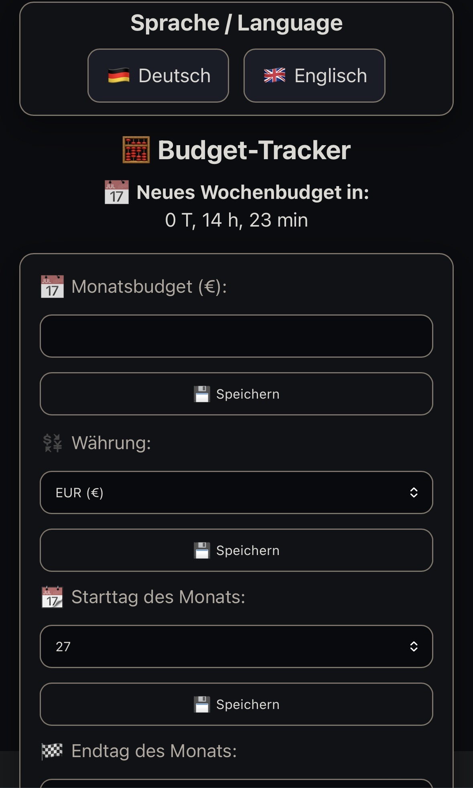
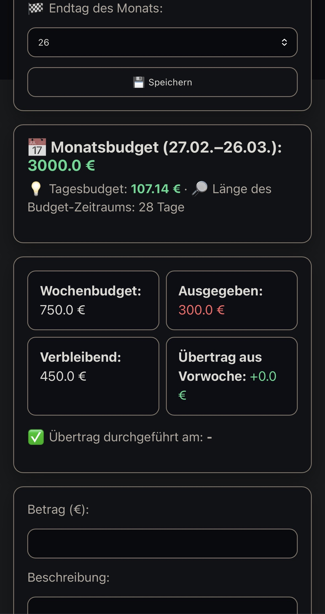
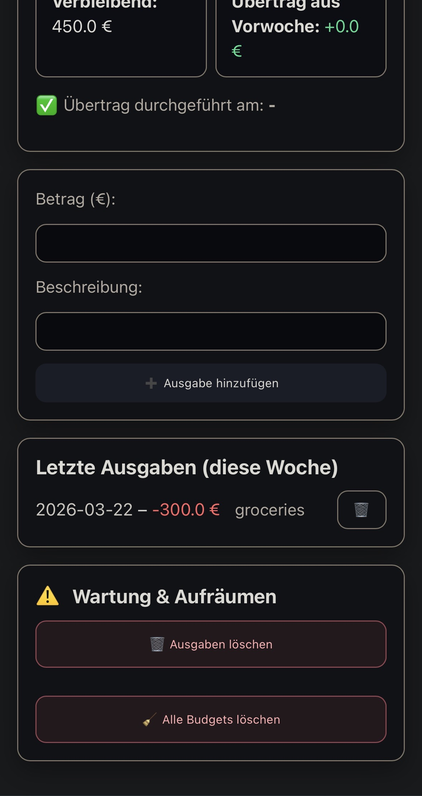

# Flask Budget Tool

🧮 **Control your money like a trader.**

A lightweight, local-first budget tool that gives you **daily control over your spending** — without cloud, subscriptions, or data tracking.

🌍 Languages: [English](#english) | [Deutsch](#deutsch)

---

## English

### 💡 Why this tool exists

Most people don’t lose money through big mistakes…  
they lose it through small daily decisions.

This tool shows you **every day**:
- how much you can spend  
- if you're over budget  
- whether you're staying in control  

---

### ⚡ What makes it different

- 🔒 100% local – your data never leaves your device  
- 📊 Weekly budget with automatic reset (Mondays)  
- 🔁 Carry-over from previous weeks  
- 🧠 Built for discipline, not distraction  
- ⚡ Lightweight – perfect for Raspberry Pi  

---

### 🚀 Who this is for

- People who want **real control over their money**
- Raspberry Pi users who prefer **local tools**
- Anyone tired of bloated finance apps and subscriptions

---

⚠️ **Note:** Official support only for Debian-based systems.  
On Windows or macOS manual setup is required.

---

---

### 🖼️ Preview

<p align="center">
  
  
  
</p>

---

### ⚙️ Installation (Raspberry Pi / Debian)

```bash
sudo apt update && sudo apt install python3 python3-venv python3-pip -y

git clone https://github.com/Python-XP1/flask-budget-tool.git
cd flask-budget-tool

python3 -m venv venv
source venv/bin/activate

pip install -r requirements.txt

python3 init_db.py
```

---

### 🚀 Run the tool

```bash
export FLASK_SECRET_KEY="$(python3 -c 'import secrets; print(secrets.token_urlsafe(48))')"
python3 app.py
```

Open in browser:

- http://localhost:5000  
- http://<IP_of_your_device>:5000  

---

### 🔧 Optional (persist key)

```bash
echo 'export FLASK_SECRET_KEY="your-secret-key"' >> ~/.zshrc
source ~/.zshrc
```

---

### 💎 Pro Version & Support

The version here is the **free basic version**.

📦 Pro features:
- Additional features  
- Bugfixes & improvements  
- Early access updates  

👉 Support:  
http://www.patreon.com/PythonXP

---

## Deutsch

### 💡 Warum dieses Tool?

Die meisten Menschen verlieren kein Geld durch große Fehler…  
sondern durch viele kleine tägliche Entscheidungen.

Dieses Tool zeigt dir jeden Tag:
- wie viel du ausgeben darfst  
- ob du über deinem Budget liegst  
- ob du dein Geld im Griff hast  

---

### ⚡ Was dieses Tool besonders macht

- 🔒 100% lokal – keine Cloud, keine Datensammlung  
- 📊 Wochenbudget mit automatischem Reset (montags)  
- 🔁 Übertrag von Restbudget aus der Vorwoche  
- 🧠 Fokus auf Disziplin statt Spielerei  
- ⚡ Extrem leichtgewichtig – perfekt für Raspberry Pi  

---

### 🚀 Für wen ist das Tool?

- Menschen, die **echte Kontrolle über ihr Geld** wollen  
- Raspberry Pi Nutzer mit Fokus auf lokale Tools  
- Alle, die keine Lust mehr auf überladene Finanz-Apps haben  

---

⚠️ **Hinweis:** Offizieller Support nur für Debian-basierte Systeme.  
Windows/macOS benötigen manuelle Anpassungen.

---

---

### 🖼️ Vorschau

<p align="center">
  
  
  
</p>

---

### ⚙️ Installation (Raspberry Pi / Debian)

```bash
sudo apt update && sudo apt install python3 python3-venv python3-pip -y

git clone https://github.com/Python-XP1/flask-budget-tool.git
cd flask-budget-tool

python3 -m venv venv
source venv/bin/activate

pip install -r requirements.txt

python3 init_db.py
```

---

### 🚀 Tool starten

```bash
export FLASK_SECRET_KEY="$(python3 -c 'import secrets; print(secrets.token_urlsafe(48))')"
python3 app.py
```

Dann im Browser öffnen:

- http://localhost:5000  
- http://<IP>:5000  

---

### 🔧 Optional dauerhaft setzen

```bash
echo 'export FLASK_SECRET_KEY="dein-key"' >> ~/.zshrc
source ~/.zshrc
```

---

### 💎 Erweiterte Version & Support

Die hier veröffentlichte Version ist die **kostenlose Basisversion**.

📦 Pro-Versionen enthalten:
- Erweiterte Funktionen  
- Verbesserungen & Bugfixes  
- Early Access Updates  

👉 Support:  
http://www.patreon.com/PythonXP